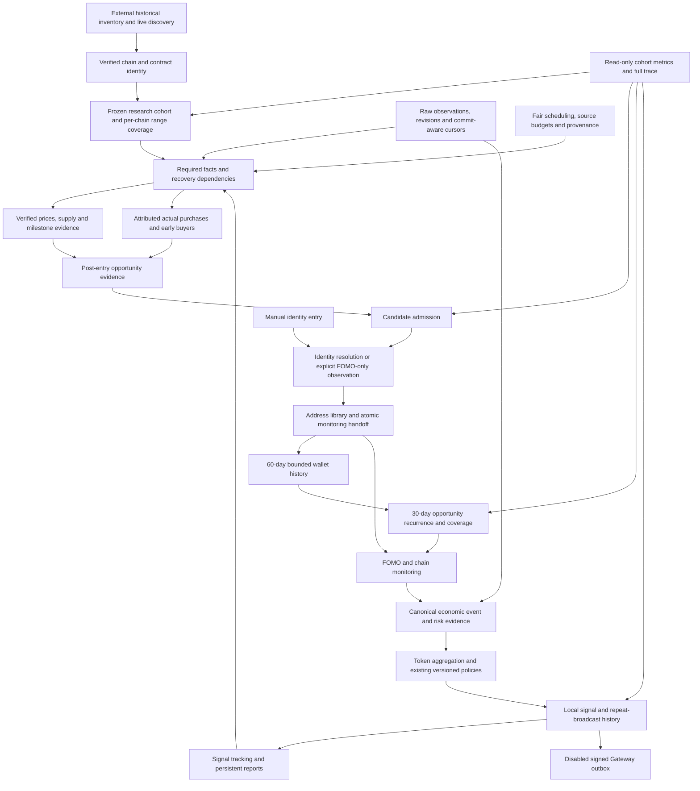

# Address Radar Full Data Lifecycle SPAC

Date: 2026-10-01, Asia/Shanghai
Status: architecture and development specification; implementation has not started under this specification.
Companion: `2026-10-01-full-data-lifecycle-development-plan.md`.

## S — Scope, product contract and boundaries

### Product purpose

Find addresses that repeatedly discover high-multiple opportunities, retain attributable evidence, resolve identities, monitor subsequent purchases, aggregate independent participants and retain qualifying radar signals. Realized profit and selling are not prerequisites. Buying a token before a verified later peak can establish discovery ability even if the trader never sells. A token peak without a valid attributable purchase cannot establish trader ability.

This specification covers the entire data lifecycle, not only the six recent bottlenecks. It extends the approved opportunity-discovery architecture and preserves its business definitions. It does not approve a rewrite, new admission thresholds, paid provider purchases, identity merging or production deployment.

### Approved rules carried forward

| Concern | Existing approved definition |
| --- | --- |
| Chains | Solana, ETH, BSC, Base and Robinhood; verify network identity independently of wallet format |
| Historical cohort | Verified first relevant 1M crossing in the research interval beginning August 10, 2026, Beijing midnight; launch time is not a membership prerequisite |
| Live discovery tiers | Existing 100K/200K at 3x or 5x, 300K at 5x, 500K at 5x or 10x, 1M at 10x or 20x |
| Discovery purchase | At least USD 50; unknown amount is not zero and cannot silently pass the amount gate |
| Candidate admission | Existing one strong distinct token or two early distinct tokens in rolling 30 days; not necessarily consecutive purchases |
| Ability | Latest rolling 30-day purchase cohort; each entry has up to 30 subsequent days of verified opportunity observation |
| Recurrence labels | Three distinct 3x tokens for repeated discovery; two distinct 5x tokens for repeated high-multiple discovery; labels may coexist |
| Wallet backfill | Recent 60 days, at most 300 token positions per wallet analysis |
| Monitoring | Resolved admitted/manual traders need not wait for recurrence confirmation; explicit FOMO identity required for FOMO monitoring |
| Missing data | Awaiting data, not a fabricated loss or absence of activity; preserve historical labels and monitoring |
| Identity | Idempotent same-owner updates; conflicts require operator resolution; no automatic merges |
| Signal history | Existing seven-day signal detail retention and persistent daily/weekly/monthly reports; operational retention must not destroy active evidence |
| Delivery | Gateway delivery remains disabled throughout development and acceptance |

The historical cohort is research inventory, not proof that a trader met a live tier. Market-cap ratios and price multiples are different measurements. Supply provenance is required before reconstructing historical market capitalization from prices.

### Decisions requiring user confirmation before coding

1. Unknown-age live signal routing: historical discovery does not require launch time, but existing live signal policy does. Do not invent a fallback window or route.
2. Eligibility contribution weights: existing numeric contribution gates must be reconciled with approved monitoring eligibility. Do not silently remove or lower them.
3. Bundle-risk treatment beyond existing policy: showing risk is approved; new exclusion, weighting or correlation thresholds require confirmation.
4. Retention periods for raw source payloads and audit logs, archival destination and automatic deletion; existing active-data protection is mandatory regardless of eventual periods.
5. Additional provider costs, credentials and chain-specific indexing scope. Unsupported capabilities must be explicit, not fabricated.

These decisions do not block measuring coverage, correcting timestamp provenance, fixing address normalization or making missing dependencies visible.

## P — Evidence, current architecture and problem register

### Analysis method and limitations

This is a system-level analysis using the approved architecture, the production read-only snapshot at 12:23 Beijing and selected source boundaries. It is not a claim that every line of every module has been audited. Implementation begins with focused call-site and schema inspection for each task. Production metrics are a point-in-time baseline, not guarantees of current progress.

Separate four evidence classes: verified source behavior; verified production observation; root-cause hypothesis requiring tracing; external capability not yet demonstrated. A capability registration or running service is not proof of usable data coverage.

### Production baseline

| Measurement | Snapshot | Interpretation |
| --- | --- | --- |
| Token discovery inventory | 2,092 | Known inventory; not all tokens existing on five chains |
| Market records / milestone stage / early-trade stage | 2,015 / 2,050 / 1,654 | Different stage populations; cannot form a coverage percentage without matching cohort keys |
| Candidate evidence facts | 1,414 | No new facts during the last hour |
| Candidate admissions / resolved identities | 393 / 122 | Different populations; not a direct subtraction funnel |
| Pending identity records | 314 | Must classify admission, account and wallet requirements separately |
| Wallet identities / signal-enabled profiles | 216 / 108 | Wallet count differs from trader count |
| Opportunity snapshots / distinct evaluated traders | 168 / 36 | Repeated snapshots are not new traders |
| Candidate blocked tasks | 1,506 | 1,412 milestone, 81 early trade, 12 price and one historical lock reason |
| Automation runnable / recovery runnable | 160 / 4,340 | Separate queues; recent near-balanced automation does not imply recovery convergence |
| Recovery satisfied / pending / terminal links | 2,172 / 2,841 / 531 | Dependency-link units, not tokens or project completion percentage |
| Ready signals / pending signal projections | 8 / 23 | Readiness differs from projection execution and delivery |
| Wallet observations added in last hour | 501 | Collection rows; not necessarily recent distinct economic buys |
| Services / delivery / disk | Six active, zero restarts / disabled / approximately 3.10 GB free | Operational health does not establish business closure |

FOMO stream latest collected data was September 23; FOMO token-history latest collected data was September 28 in the preceding inspection. Both had zero raw additions in the latest hour. EVM wallet coverage registration existed while unified wallet observation output was absent in the inspected dataset. Those findings require boundary tracing, not an assumption that wallets were inactive.

### Existing execution and persistence ownership

| Boundary | Current files | Responsibility and relevant limitation |
| --- | --- | --- |
| Scanner | `apps/scanner/src/runtime.ts` | Source ingestion, market lookup, evidence and signals; historical event time can be used for current market snapshots |
| Wallet monitor | `apps/wallet-monitor/src/runtime.ts`, `collectors.ts` | Wallet registry, RPC extraction, observations and checkpoints; extraction success differs from usable trade output |
| Historical service | `apps/wallet-analysis/src/historical-cli.ts`, historical providers and workers | Partitioned history and buyer recovery; actual per-provider coverage must be measured |
| Automation | `apps/automation/src/runtime.ts`, `scheduler.ts`, workers | Fair execution, reconciliations, downstream tasks; several separate queues and progress units |
| Fact recovery | `token-fact-orchestrator.ts`, `provider-route-registry.ts`, source ledger and fact links | Dependency graph and source attempts; status alone currently permits partial dependencies |
| Identity | `packages/identity/src/*`, database repository and outbox | Ownership, manual/FOMO resolution, monitoring handoff; account, wallet and trader are distinct |
| Ability | Opportunity evaluator, opportunity history, ability worker | Versioned 30-day opportunity recurrence; authoritative range completeness remains required |
| Aggregation | `packages/aggregation/src/*` | Canonical events, participant independence, contribution and token windows |
| Signal projection | `apps/automation/src/signal-projection-worker.ts`, signal engine | Revision-based projection; fingerprint includes evaluation timestamps |
| FOMO bridge | `scripts/sync-fomo-verification.sh` | Bidirectional byte-offset copying to/from the original project; copied bytes do not prove committed normalized results |
| Console/audit | `apps/console/src/application.ts`, public renderer, `scripts/audit-data-closure.ts` | Stage views and closure audit; legacy counts can mix versions, populations and execution with progress |

### Problem register

| ID | Classification | Finding | Upstream/downstream impact | Resolution direction |
| --- | --- | --- | --- | --- |
| F01 | Verified source | Scanner timestamps a current market lookup with historical event time | Fabricated historic price or crossing can contaminate opportunity evidence | Separate occurrence, market observation and collection times; quarantine derived assessments until replay |
| F02 | Verified source | Wallet ownership lookup lowercases Solana addresses | Wrong attribution or address collision | Chain-aware keys at every ownership and token boundary |
| F03 | Verified source boundary | Collector uses spot price for historical swaps; EVM amount is null in inspected extraction path | Unusable entry basis and amount gates; current value can masquerade as historical execution | Derive execution from attributable quote/base deltas, retain exact provenance, reject ambiguous allocation |
| F04 | Verified source | Fact dependency check accepts every partial/degraded status | Downstream attempts run without required range/precision | Demand-specific coverage contracts, not status-only readiness |
| F05 | Verified source | Registry selects one route by attempt index; unavailable route can become terminal | Temporary budgets/circuit state can look like permanent lack of coverage | Distinguish temporary exhaustion, supported-empty and unsupported capability |
| F06 | Verified source | Local historical source reads existing database pages | Empty local partitions do not discover missing inventory | Separate upstream enumeration, import, replay and frozen-cohort coverage |
| F07 | Verified production; cause open | FOMO raw trade additions stopped | Recovery metadata can progress without new trader facts | Trace request, execution, session, parsing, result transfer, ingestion and commit |
| F08 | Verified production; cause open | EVM observation output absent despite registered monitoring coverage | Other-chain absence is incorrectly read as inactivity | Per-chain block/receipt/parse/normalize/persist/projection diagnostics and fixtures |
| F09 | Verified production; cause open | Only 36 distinct traders have new opportunity snapshots | Repeated small-cohort evaluations can conceal legacy backlog | Versioned dispatcher/cohort cursor and latest-per-trader strategy counters |
| F10 | Verified source risk | Projection fingerprints include assessment timestamps | Metadata reevaluation can generate projection churn | Fingerprint semantic eligibility/evidence; coalesce superseded revisions without losing real buys |
| F11 | Verified source risk | Canonical matcher accepts null amounts as compatible and selects first candidate | Possible false merging if surrounding query is not restrictive enough | Inspect caller constraints; transaction-anchored matching and explicit ambiguity handling |
| F12 | Verified audit limitation | Closure audit relies on row presence and mixed snapshot versions | False-ready result with stale sources or absent chain output | Same-cohort, latest-version and coverage-aware closure checks |
| F13 | Verified production | Recovery backlog increased while writes continued | Task completion is not backlog drainage | Fair budgets, prerequisite-first execution, churn accounting and rate-based progress |
| F14 | Verified operational risk | Disk approximately 93% used | Backup, WAL and write capacity at risk | Protect active facts; bounded logs/archive and explicit safe headroom gates |
| F15 | Compatibility boundary | Manual legacy trust was repaired in release f5ff094 | Broad confidence promotion could undo safe identity behavior | Preserve narrow trusted mappings, disabled overrides and suspended protections |
| F16 | External coverage not proved | Full historical buyers/prices are not demonstrated for every chain/provider | Cannot promise exhaustive discovery | Capability matrix and bounded uncovered-range reports; no invented facts |

## A — Target architecture within existing services

### Complete flow

### A1. Shared data contracts

Every fact carries canonical chain/CA, source object ID, source/provider, event time, observed time, collected time, known-at time, revision, precision, coverage and raw-reference hash. Wallet attribution additionally carries owner evidence and transaction/signature/log identity. Precision is explicit: transaction execution, historical candle, contemporaneous spot, interval-estimated crossing or verified exact crossing.

Cohort membership records its reason and evidence. A later revision changes the assessment without duplicating the economic buy. Never derive observed-at from collection time unless the provider actually observed contemporaneously; never move a current snapshot backward to an event timestamp.

### A2. Source acquisition and capability routing

Maintain a matrix per chain, source, fact type, interval granularity, earliest available range, cursor semantics, rate budget and authentication requirement. A configured adapter is not a demonstrated capability. Historical inventory and local replay use separate jobs and counters.

FOMO execution moves into Address Radar only after locating the actual authenticated collector and normalizer. Internal durable requests/results remain necessary even without cross-project file copying. Shadow comparison uses captured responses; single-owner cutover preserves source IDs and commit cursors. Expired sessions pause authenticated work and expose operator action. No browser login bypass or unsupported endpoint guessing.

RPC fallback is limited to data that the configured provider/index actually exposes. EVM full wallet history requires an index; ordinary RPC alone is not treated as that index. Index checkpoints include chain ID, block hash, finalized range and reorg rollback. Unknown Robinhood network mappings remain explicit until verified.

### A3. Raw retention, normalization and exactly-once effects

Persist raw observations before advancing their cursor. Validate complete records and checksums before ingesting copied files. Offset tracking includes file generation/inode or stable journal generation, not byte offset alone. Crash between append and cursor commit must replay idempotently, not lose facts.

For swaps, verify successful execution, quote/base movements, token decimals, fees and multi-hop/multi-token ambiguity. Do not count airdrops, plain transfers, approvals, failed transactions or router artifacts as buys. Use historically attributable quote valuation; stablecoin units alone do not guarantee USD parity. Exact quote/base ratios require a defensible allocation. Unknown amount or entry basis requests recovery rather than using current spot.

Preserve wallet family versus network identity. Use chain-aware case rules. Match FOMO/chain economic events by transaction and ownership anchors first; time/amount heuristics are ambiguity evidence, not unconditional identity. Repeated independent buys remain separate events.

### A4. Demand-specific recovery closure

A dependency is satisfied only when a specific consumer's required fields, identity, precision and interval are present. Positive hits can use valid partial historical evidence; proving a mature non-hit requires verified continuous coverage. Partial market history therefore may satisfy a positive-hit demand but not a complete-range demand.

Persist missing-demand reasons and upstream requests. Schedule required upstream facts before dependents. One semantic demand has one active recovery owner; multiple consumers share facts rather than duplicate network calls. Wake only consumers whose demands have become satisfied. Out-of-order results cannot overwrite newer proven coverage. Fresh capabilities/new revisions may reopen terminal work through audited, bounded reconciliation.

Temporary rate exhaustion, circuit cooldown, query timeout, expired session, unsupported chain, no pool, exact-CA not found, partial history and authoritative empty history have different states. Timeout or an empty cache is not proof of terminal absence. Terminal uncovered ranges remain visible and do not block every other token.

### A5. Trader discovery, identity and history

Evidence references actual entry and post-entry peak facts, evaluation as-of and tier policy version. Same token at several milestones contributes one distinct-token opportunity. Identity queue explicitly distinguishes admitted-without-wallet, unresolved account, conflict, FOMO-only and manually submitted identity.

Same-owner writes are idempotent; different owners never merge automatically. Save identity/tags and monitoring outbox atomically. Outbox consumption schedules monitoring and bounded initial history once per semantic subject. A single-chain wallet is valid. Manual remarks are not fabricated FOMO handles. Resolved candidates leave the pending-resolution view while their evidence and admission history remain auditable.

Wallet backfill is split into wallet/date ranges, provider pages and token-position analyses within the approved 60-day/300-position bounds. Cursor progress records covered intervals, accepted unique trades and completion reason. Reaching a cap is bounded completion, not exhaustive history. New live events are not starved by old-history work.

### A6. Ability and risk

Use latest-per-trader strategy-specific snapshots. Dispatch cursors include strategy version, cohort generation and as-of; changing strategy must not inherit an exhausted old cursor. Incremental reevaluation follows new facts, not only clock refresh. Each result exposes valid entries, distinct tokens, positive hits, covered/non-covered ranges and historical versus current labels.

Observed opportunity maxima are not realized returns. Missing data is not a losing sample. Avoid survivorship claims: discovering buyers of successful tokens is selection-biased, so recurrence analysis must include the wallet's other observable valid purchases, not only known winners. Display observed-opportunity rate with its denominator and completeness; no new automatic gate is approved.

Bundle risk preserves evidence about correlated timing, funding or repeated co-entry; timing alone does not prove common ownership. Correlated traders cannot be presented as independent confirmations without the existing independence policy being applied and explained.

### A7. Aggregation, signal readiness and delivery

Separate identity eligibility, amount eligibility, contribution, lifecycle route, participant independence and final policy decision. Every rejection lists its precise missing condition. Unknown launch age affects existing live policy only; it never excludes historical research. Any unknown-age fallback is a pending business decision.

Reevaluation with unchanged semantic inputs must not consume fresh evidence or increment broadcast count. Real new qualifying purchases can update the retained signal and repeat count. Outbox delivery status depends on acknowledgement, not local generation. Failed/retried delivery cannot create duplicate signals. Keep Gateway disabled.

Track signal-time market cap, later observed market cap and verified post-signal peak with timestamps/provenance; unavailable prices remain unknown. Seven-day signal detail expiry cannot erase evidence needed for daily/weekly/monthly persisted reports or active historical research. Report generation is idempotent with versioned corrections.

### A8. Scheduling and storage

Separate live work, history, recovery, ability and projections with bounded fair scheduling and shared provider budgets across processes. Requests waiting for an external response release worker capacity. Leases, fencing, heartbeat and crash recovery prevent double commits. Run bounded database transactions without network I/O inside locks. Preserve the current SQLite architecture first; expose a write-command seam for future single-writer evolution rather than introducing an unapproved second database.

Measure admitted work, actual execution, unique fact gain, backlog arrival/drainage and oldest actionable wait. Limit duplicate revisions and repeated empty rescans. Use SQL indexes justified by query plans during authorized tests. Keep WAL, logs, backups and release artifacts separately accounted. Any cleanup protects unresolved jobs, referenced raw payloads, business facts, identity records and rollback evidence.

### A9. Observability and console

Provide a read-only same-cohort progress API and token/trader trace. Each stage reports population unit, strategy/source revision, total, satisfied, pending, terminal, new unique facts, actual latest progress and source coverage. Label execution-only metrics separately. Missing denominator means unknown coverage, not zero or 100%.

Display five-chain views, source/session health, FOMO raw-data freshness, EVM transaction extraction funnel, identity handoff and latest strategy evaluation coverage. Use one record per row and human-readable Chinese statuses, with optional technical detail. The main dashboard must show where the next meaningful fact is expected and who owns it.

## C — Acceptance, migration and safeguards

### Acceptance hierarchy

1. Pure deterministic tests for identity, time, opportunity, coverage and event matching.
2. Fixture integration across ingestion, persistence, dependency wake-up, identity handoff and projections.
3. Crash/replay, reorg, session expiry, rate-limit and out-of-order-result tests.
4. Full regression, type checking, builds and relevant console end-to-end tests when authorized.
5. Dry-run bounded data repair with affected rows, provenance, backups and reversible release plan.
6. Production read-only acceptance on real token/trader traces; fixtures never count as production signal output.

Select real traces from every supported chain: successful discovery, pending data, no qualifying buy and explicit unsupported coverage. A chain without sufficient usable data is partially accepted, not silently marked complete. Real-time acceptance may finish without a signal if no genuine purchase meets the unchanged policy; demonstrate the exact no-output condition separately from software malfunction.

### Required invariants

- No current-price snapshot is represented as an earlier historical observation.
- No pre-entry/future peak qualifies a purchase.
- No missing amount, wallet, entry basis or source interval is silently invented.
- No Solana identity loses case.
- No wallet crosses owners without explicit conflict resolution.
- No cursor advances beyond committed source records or skips unresolved pages.
- No repeated replay creates a second economic event, opportunity, task or report.
- No partial coverage proves a complete non-hit.
- No service heartbeat or repeated snapshot is counted as a new token/trader.
- No source outage becomes trader inactivity or losing ability evidence.
- No projection refresh increments a broadcast without qualifying new evidence.
- No automatic cleanup removes active/referenced historical facts.
- Gateway delivery stays disabled.

### Completion definition

Engineering completion means the documented boundaries, tests, metrics and recovery behaviors are implemented and reviewed. Data closure means each frozen cohort demand is satisfied or explicitly uncovered, and successful traces reach downstream consumption. Production-wide stability additionally requires comparable repeated snapshots showing real progress and bounded queues. These are separate acceptance records; none can substitute for the others.

No completion date is promised from the current repeated-evaluation throughput. Estimate only from stable unique-demand drainage on a frozen cohort, reporting uncovered external ranges separately.
