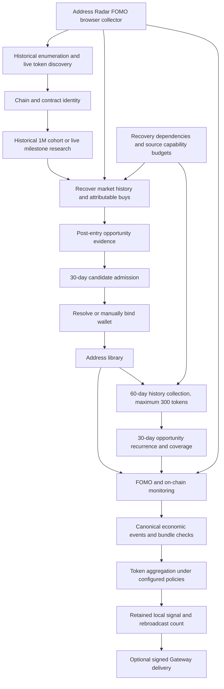

# Address Radar Opportunity Discovery Architecture SPAC

Date: 2026-10-01, Asia/Shanghai

Status: the four core business rule groups were explicitly approved by the user on October 1, 2026. The first implementation checkpoint adds opportunity calculation and recurrence labels to the existing ability paths. Production rollout, data repair and collector cutover require their own acceptance checkpoint. Source changes are developed in `/Users/a77/Documents/ChatGPT/address-radar`; this document workspace is a separate React application.

## S: Scope and agreed business definition

The product identifies traders who repeatedly discover high-multiple opportunities, resolves their wallets, observes subsequent purchases and emits token radar signals when aggregation policies qualify. A sale or realized profit is not a prerequisite for discovery ability. Opportunity evidence still requires an attributable purchase, a usable entry basis and a subsequent verified price or market-cap observation. A token's price increase alone does not establish an individual trader's ability.

Historical research includes tokens reaching USD 1M during the window beginning `2026-08-09T16:00:00.000Z` (August 10 midnight in Beijing). Creation and launch timestamps are optional metadata for this historical cohort. The canonical chains are Solana, ETH, BSC, Base and Robinhood. Chain identity must be verified independently of wallet address format.

Live lower milestones remain 100K, 200K, 300K, 500K and 1M. Existing candidate tiers remain unchanged: 100K/200K at 3x or 5x; 300K at 5x; 500K at 5x or 10x; 1M at 10x or 20x. A qualifying purchase is at least USD 50. Recent candidate admission remains one strong distinct token or two early distinct tokens in 30 days. These tokens need not be consecutive purchases.

Candidate admission recognizes initial discovery ability. Resolved admitted traders can be monitored while historical analysis improves confidence. A missing wallet leads to visible identity resolution, while legitimate FOMO-only observation remains possible. Saving a verified identity must not depend on completing ability analysis.

Wallet collection remains bounded to 60 days and 300 token positions. The primary ability window selects valid purchases within the latest rolling 30 days. Each purchase has a separate opportunity observation period of at most 30 days after entry. Shorter diagnostic windows do not replace that primary decision. Source gaps and trader inactivity are not automatically negative ability evidence.

Gateway delivery remains disabled during development and acceptance. Local qualifying signals are retained separately from delivery acknowledgments.

## P: Verified problems and evidence boundaries

The following findings are based on source inspection, not a fresh production snapshot:

| Finding | Existing implementation | Business impact | Required change |
| --- | --- | --- | --- |
| Conflicting score basis | `trader-ability-evaluator.ts` selects fixed-horizon close values; `scoring.ts` weights captured performance at 20% | A trader can discover a large opportunity but receive a weaker score after retracement or without selling | Introduce versioned opportunity scoring using verified MFE; retain realized/captured values as separate diagnostics |
| Weak recurrence definition | `performance.ts` counts multiples greater than 1 as successful | Ordinary positive performance is presented as high-multiple recurrence | Count distinct tokens reaching 3x and report 5x/10x separately |
| Activity-span gate | Stable decision requires a 14-day span for all windows | Short windows cannot qualify and concentrated activity is penalized independently of evidence | Use 30-day primary evaluation; retain span as a diagnostic |
| Valuation mistaken for opportunity | Ability worker synthesizes outcomes from realized value plus remaining value | Current holdings valuation can neither prove nor disprove an earlier opportunity | Require peak observations after entry for opportunity; never substitute holdings valuation |
| Case-unsafe token keys | Performance grouping and wallet-history joining lowercase all addresses | Distinct Solana mints can collapse into one sample | Use the existing chain-aware address normalizer at every touched boundary |
| Local replay mistaken for discovery | SQLite historical source only pages known rows | Empty local partitions wait without acquiring new inventory | Separate upstream enumeration, local replay and coverage completeness |
| External collector ownership | Existing production FOMO requests/results cross project journals | Timer success does not prove query completion; maintenance depends on another project | Move browser collection ownership into Address Radar using durable internal jobs and result ingestion |
| Identity and admission ambiguity | Evidence, admission, wallet binding, lifecycle and ability are distinct records | Console counts look like one funnel despite different populations | Define explicit state transitions and same-cohort counters |
| Execution mistaken for progress | Snapshot timestamps and completed jobs can increase without new evidence | Repeated evaluations appear to be business advancement | Count new distinct facts, coverage expansion and changed decisions separately |

No claim is made that all provider timeouts have been diagnosed. Existing September 30 audit counts are historical context, not today's live state. Launch-time absence and null realized returns are not blockers under the accepted business definition.

## A: Architecture

### Chosen approach and alternatives

Use incremental correction within the current six-service architecture. Reuse the source ledger, recovery dependencies, canonical events, identity services and outbox. Introduce a shared opportunity contract and versioned evaluation first, then migrate collection ownership and align projections.

A rewrite would provide new boundaries but would duplicate queues, evidence and migration obligations. A console-only relabel would be cheaper but retain inconsistent calculations. Incremental correction offers bounded changes and preserves replayable facts.

### Module ownership

| Module | Responsibility | Durable contract |
| --- | --- | --- |
| Collectors | Fetch source data, normalize envelopes, declare range and coverage | Source observation ID, provider, chain, CA, observed time, collected time, cursor, coverage |
| Scanner and recovery | Validate provenance, persist facts, reconcile revisions and dependencies | Fact revision, dependency, attempt and recoverable reason |
| Historical backfill | Enumerate upstream inventory and obtain market/buyer ranges | Frozen cohort ID, scope, page cursor, coverage proof |
| Identity | Bind platform accounts and wallets to canonical traders | Explicit ownership evidence, uniqueness, conflict and idempotent update |
| Scoring | Pure opportunity, admission and recurrence decisions | Strategy version, as-of time, evidence basis and metrics |
| Automation | Fair, bounded execution and downstream wake-up | Task type, subject, input revision, lease and outcome |
| Monitoring and aggregation | Reconcile FOMO/on-chain economic events; count independent entities | Stable economic event ID, eligibility and contribution |
| Console | Explain business stages and missing dependencies | Same-cohort counts, freshness, actual progress and next action |

### Opportunity contract and time rules

For a valid entry, `opportunityMultiple = verifiedPeakPriceAfterEntry / weightedEntryPrice`. Market-cap ratios may serve existing milestone evidence only when their supply basis and observation range are explicit; price and market-cap ratios must not be silently interchanged.

Only observations after entry, within 30 days of that entry, and at or before evaluation as-of are eligible. Future-computed results, pre-entry peaks, unknown entry price, invalid values and unmatched chain/CA cannot qualify. A complete fixed-horizon outcome's MFE is usable evidence within that horizon; it must not be labeled complete 30-day price coverage. A later data revision replaces the earlier assessment rather than accumulating duplicate opportunities.

A verified hit is recorded immediately even if the observation period is still open. A purchase that has not reached a threshold remains observing until the period closes. Missing entry basis or historical coverage returns awaiting-data and schedules recovery, never an artificial zero return. A complete 30-day observation range without a hit is a non-hit with its actual observed maximum retained. Partial ranges without a hit remain incomplete even after 30 days.

Report distinct-token 3x, 5x and 10x hits, observed opportunity mean/median, valid sample count, complete-range coverage and partial-range positive evidence separately. Realized return, captured return and marked-to-market return remain optional diagnostics with their own labels. Missing MFE never falls back to close return or current wallet valuation.

### Initial recognition and recurrence

Candidate admission keeps its accepted tier rules. A resolved admitted trader joins monitoring without waiting for confirmed recurrence. Manual priority and the 30-day TOP100 source remain explicit sources, not fabricated opportunity evidence.

The approved recurrence labels are independent and may coexist:

| Label | Approved rule |
| --- | --- |
| Initial recognition | Meets the existing candidate admission rule; eligible for monitoring once identity requirements are met |
| Repeated discovery | At least three distinct tokens have verified 3x opportunities among valid purchases in the latest 30 days |
| Repeated high-multiple discovery | At least two distinct tokens have verified 5x opportunities among valid purchases in the latest 30 days |

Repeated purchases and multiple milestone labels on the same chain/CA count as one independent token for each recurrence label. Sample count, range coverage, 10x count, activity span and opportunity concentration are diagnostic fields. Neither eight samples nor 70% coverage is an approved hard gate. No new numerical score weighting is approved in this phase.

Insufficient source coverage must return an explanatory reason. Preserve historical capability labels separately from current 30-day recurrence. When supporting purchases age out of the latest 30 days, show awaiting-recent-recurrence while retaining historical labels. Low or absent recent activity is displayed as recently-inactive and does not cause automatic elimination. No numerical inactivity timeout has been approved; its display must describe the actual observed activity window rather than introduce a hidden threshold. These addresses remain monitored and their new purchases are evaluated under signal policy. Provider outages do not establish adverse business evidence. Old snapshots remain readable and carry their original strategy version; changed semantics require new snapshots.

### Identity and monitoring

Direct source wallets require verified chain, valid address and explicit attribution. FOMO account IDs or handles must never be interpreted as wallets merely because they resemble addresses. Matching an existing wallet updates that entity idempotently; conflicting owners require operator resolution and never automatic identity merging.

Each binding atomically saves ownership, tags and an outbox notification. A single active initial-history task per canonical subject is maintained. Admitted traders with resolved wallets join on-chain monitoring immediately; a verified FOMO identity additionally enables FOMO observation. Manually added priority wallets join monitoring after saving without needing recurrence confirmation. Event arrival from either FOMO or chain sources triggers token projection; duplicate reports of the same transaction count once, while separate genuine purchases remain separate events. Similar buys within five or ten seconds on several tokens produce bundle-risk evidence, not automatic ownership merging.

### FOMO collector migration

Build an Address Radar collector adapter around the verified existing browser implementation. Discover the actual collector source and authenticated browser contract before transplanting code; the browser extension workspace is not evidence of the production collector implementation.

Retain durable internal lookup jobs with request ID, purpose, token identity, cursor, attempt, lease and result status. Browser session expiration must be visible and pause authenticated work. Query timeout, unsupported chain, not-found with exact-CA checking, partial history and complete history are distinct outcomes. Share provider budgets and bound retry schedules.

Run shadow ingestion using the same captured response fixtures; compare source IDs and normalized facts before a single-owner cutover. Internal durability remains necessary after removing cross-project file copying. Do not run two active consumers against one browser profile or reset existing cursors during cutover.

### Live signal policy

Initial recognition, repeated discovery and repeated high-multiple discovery are visible labels. Recurrence confirmation is not required for an admitted trader to contribute a qualifying purchase. New numerical score weights must be separately confirmed before implementation. Preserve existing new-token and old-token aggregation amount, participant and route policies during this correction. Launch time can remain an optional live route input; unknown age needs an explicit observable route rather than exclusion from historical research. Any live-route policy change requires its own version and acceptance cases.

For repeated qualifying events on the same chain/CA, update the existing signal's broadcast count. Bundled traders must not inflate independent participant counts. Store signal-time market cap, current market cap and peak observed multiple with provenance; delivery status depends on Gateway acknowledgement, not local projection completion.

## C: Code-system implementation plan

Execute in this session. No automatic commit is authorized by this document. Source changes and production writes are separate checkpoints.

### C1: Shared definitions and deterministic scoring

Files: `packages/scoring/src/scoring.ts`, `packages/scoring/src/trader-ability-evaluator.ts`, `packages/scoring/src/index.ts`; corresponding scoring tests.

- [ ] Establish a versioned opportunity measurement contract using verified post-entry MFE; remove captured return as a discovery prerequisite without introducing unapproved numerical score weights.
- [ ] Add explicit 3x opportunity rate and opportunity mean/median; retain close/captured diagnostics.
- [ ] Test an unsold buy reaching 5x and later closing below entry, missing MFE, future data and recomputation.
- [ ] Preserve the legacy score API for old callers and historical interpretation.

### C2: Repeatability and address identity correction

Files: `apps/wallet-analysis/src/performance.ts`, `apps/automation/src/trader-ability-worker.ts`, `apps/automation/test/trader-ability-worker.test.ts`; a focused performance regression test.

- [ ] Use verified MFE for recurrence; recognize three distinct 3x tokens and two distinct 5x tokens independently.
- [ ] Restrict confirmed recurrence to the primary 30-day window and remove the hard 14-day activity gate.
- [ ] Remove the unapproved eight-sample and 70% hard gates; expose counts and coverage as diagnostics.
- [ ] Preserve missing-data reasons, incomplete observation states, historical labels and ongoing monitoring when activity is sparse or evidence ages out.
- [ ] Read MFE from persisted outcomes; use post-entry market observations for wallet-history entries when a valid entry basis exists.
- [ ] Preserve Solana case in grouping, wallet token parsing and distinct-token sets.
- [ ] Version new worker snapshots and retain legacy records.

### C3: Complete opportunity ranges and downstream eligibility

Files to inspect and constrain before editing: `packages/scoring/src/trader-outcome-scheduler.ts`, `packages/database/src/repository.ts`, `packages/identity/src/identity-automation.ts`, `packages/identity/src/candidate-admission-service.ts`, actual monitoring policy consumer.

- [ ] Extend each purchase's opportunity observation to at most 30 days after entry, separately from the rolling 30-day purchase cohort, without pretending sparse points are complete coverage.
- [ ] Ensure admitted resolved identities reach monitoring independent of confirmed recurrence.
- [ ] Distinguish source-unavailable from genuine opportunity misses and historical evidence aging.
- [ ] Verify evidence date versus collection date so delayed backfill cannot fabricate recent admission.

### C4: Source acquisition and collector ownership

Files: `apps/automation/src/token-source-adapters.ts`, `apps/wallet-analysis/src/historical-stage-planner.ts`, `apps/scanner/src/collectors.ts`, collector source identified from production wiring; new Address Radar browser adapter and tests.

- [ ] Separate provider enumeration from local replay and record coverage denominators by chain/date.
- [ ] Historical inclusion uses reaching 1M inside the window, with optional launch metadata.
- [ ] Locate real production collector source and captured authenticated contracts before implementing browser jobs.
- [ ] Move lookup execution and normalization into Address Radar; shadow-compare source identities and exact-CA results.
- [ ] Preserve request/result provenance, cancellation, cooldown and session-expiry diagnostics.

### C5: Console and end-to-end evidence

Files: `apps/console/src/application.ts`, actual production workbench renderer, console tests. The independent React workspace requires API-wiring verification before editing it as a production console.

- [ ] Display discovery ability, recurrence confidence, identity resolution and monitoring as separate states.
- [ ] Label opportunity hits explicitly; realized diagnostics must not be labeled discovery requirements.
- [ ] Show same-cohort denominators, actual new facts, range coverage, waiting reasons and latest real progress.
- [ ] Trace token → milestone → buy → trader → evidence → admission → wallet → history → ability → new buy → aggregation → signal.

### C6: Bounded reconciliation and release acceptance

- [ ] Produce a dry-run of affected entities, source versions, missing facts and deduplicated reevaluation jobs.
- [ ] Preserve original source rows and old snapshots; do not infer historic MFE from present prices or holdings valuations.
- [ ] Run focused tests, full tests and type checking before a release checkpoint.
- [ ] Backup with sufficient disk margin; perform only approved production migration/cutover.
- [ ] Verify two hours of fact growth, fair task execution, identity handoff and qualifying live signal projection with Gateway delivery disabled.

## Acceptance cases

| Case | Expected result |
| --- | --- |
| Bought at USD 1, verified later peak USD 5, never sold, close USD 0.8 | Qualifying 5x discovery opportunity; realized profit remains unknown |
| Token peaked before purchase | Peak cannot qualify that purchase |
| Missing entry cost or market history | Explicit unavailable/partial coverage, not zero return |
| Token launched before August 10 but reached 1M within scope | Included in historical research |
| Unknown launch time with verified 1M crossing | Included; optional metadata remains unknown |
| Two tiers for one token | One independent token |
| Two Solana mints differing in case | Two distinct identities |
| Three distinct tokens reach 3x within the current purchase cohort | Repeated discovery label; no eight-sample, 70% coverage or 14-day activity gate |
| Two distinct tokens reach 5x within the current purchase cohort | Repeated high-multiple discovery label; may coexist with repeated discovery |
| Peak occurs more than 30 days after the relevant entry | Does not contribute to that entry's opportunity measurement |
| Verified hit before the observation period closes | Record the hit immediately and retain observation-period status |
| Complete observation period closes without a hit | Non-hit with the actual maximum retained |
| Observation period closes with missing source coverage | Awaiting-data; not a fabricated non-hit |
| Recent activity is sparse or absent | Visible activity information, historical labels preserved, monitoring continues |
| Previously supporting purchases age out of the current cohort | Awaiting recent recurrence; preserve historical labels and monitoring |
| Provider outage after prior confirmation | Coverage warning; no automatic adverse business judgment |
| Admitted trader without wallet | Visible identity resolution and permitted FOMO-only observation |
| Same buy from FOMO and chain | One economic event |
| Several correlated wallets buying within five seconds | Bundle-risk evidence and participant independence review |
| Source query completes with no qualifying events | Explained no-output; no synthetic signal |
| Projection completes while delivery disabled | Local readiness only, no delivered-user count |

## Execution status

The user has approved all four business rule groups: opportunity observation, recurrence labels, missing-data/inactivity handling, and monitoring/broadcast behavior. This approval supersedes the earlier suggested eight-sample/70% defaults. A separate October 1 read-only heartbeat inspected production progress and did not change production data or policy.

### Checkpoint 1: opportunity calculation and recurrence integration

Implemented source boundaries:

- `packages/scoring/src/trader-opportunity-evaluator.ts`: pure, versioned per-purchase opportunity evaluation, the 30-day observation cap, distinct-token recurrence and explicit hit/observing/awaiting-data/missed/excluded results.
- `apps/wallet-analysis/src/opportunity-history.ts`: actual purchase events and bounded market history; persisted MFE is accepted only with usable entry basis, range and computation time. Close values and wallet holdings valuations are not substituted for missing opportunity evidence.
- `apps/wallet-analysis/src/performance.ts`: chain-aware grouping and opportunity integration in the existing performance path. The legacy repeatability function remains available for compatibility, while the active automation worker supplies the approved opportunity evaluation.
- `apps/automation/src/trader-ability-worker.ts`: strategy `trader-ability-v4-opportunity`, a primary 30-day recurrence snapshot, approved recurrence labels in reason codes, and no legacy sample-count/span gate in this path.
- `packages/scoring/src/trader-performance-evaluation.ts`: additive opportunity metrics and flags in existing snapshot JSON; strategy-specific snapshot IDs preserve legacy records. Legacy numerical scores remain diagnostics with unchanged weights. Their lifecycle promotion/demotion rules are not applied when the approved opportunity evaluation is supplied.

Both recurrence labels can coexist. Token counts preserve Solana mint case, normalize EVM address case and distinguish chains. Direct purchases take precedence over an older aggregate-position entry for the same token, so a recent new buy is not hidden by the position's original date.

No schema migration is introduced. No commit, production database write, service restart or deployment has been performed for this checkpoint.

Coverage boundary: existing sparse price rows and short fixed-horizon outcomes can prove a positive opportunity but do not prove complete 30-day coverage. The pure contract accepts continuous verified coverage ranges; the current history adapter does not manufacture those ranges from sparse observations. Consequently, a mature non-hit without range proof remains awaiting-data. Connecting authoritative range coverage and its recovery requests remains C3/C4 work.

Remaining work includes detailed console labels, preserved historical label presentation and aging, monitoring handoff, automatic range recovery, the independent FOMO collector and controlled production reevaluation. The first checkpoint does not establish production-wide closure.

Validation follows test-first development: new business and integration tests failed against the previous implementation, then passed after the changes. The initial full regression run passed 687 tests; an added snapshot-version test detected an ID collision, which was fixed.

Final checkpoint validation:

- `pnpm build`: passed.
- `pnpm typecheck`: passed, including test types.
- Final full Vitest run: 169 test files, 689 tests passed, zero failures.
- JSON test report: `/private/tmp/address-radar-opportunity-test-results.json`.
- Targeted tests cover an unsold 5x followed by retracement, pre-entry/future/late-collected/out-of-window prices, continuous versus gapped coverage, independent recurrence labels, case-sensitive Solana identity, recent buys in old positions, historical MFE boundaries, durable opportunity metrics and separate new/legacy snapshot IDs.

Next checkpoint: identity/address-library monitoring handoff and console presentation. Source coverage recovery and collector ownership remain separate implementation work. Production continues running the previous release until an explicitly approved release checkpoint.
