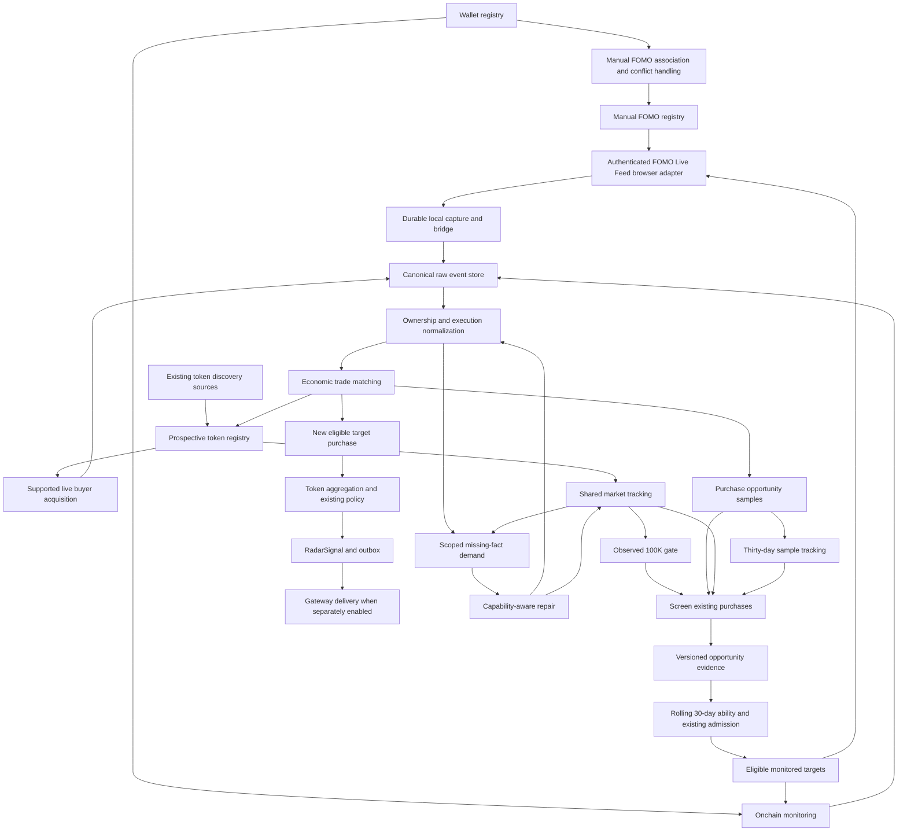
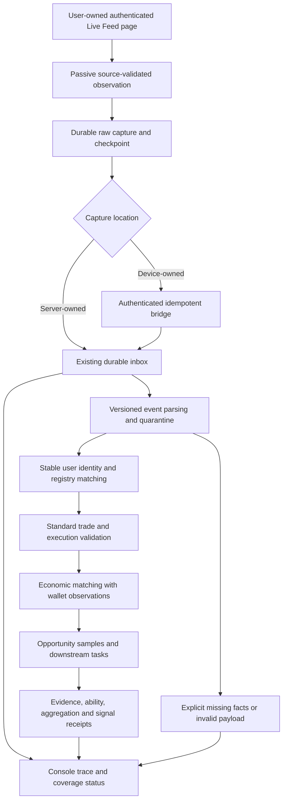

# Address Radar Forward Opportunity Discovery SPAC

**Status:** Design for review; no implementation, migration, scheduling change or production cutover is authorized by this document alone.
**Date:** 2026-10-02
**Companion plan:** `2026-10-02-forward-opportunity-radar-development-plan.md`
**Business owner:** User approval recorded in this conversation.

## S — Scope and approved business semantics

### Objective

Continuously acquire real trades from monitored FOMO users, monitored wallets and supported prospective token-trade sources. Discover participants whose purchases precede high-multiple opportunities. Resolve FOMO-to-wallet identities independently. Generate radar signals from eligible targets' subsequent purchases using the existing signal policy.

Discovery capability does not require a realized sale. A manual identity confirmation is not proof of capability. A directory entry, platform follow, subscription, collector connection and received trade are different facts.

### Authoritative decision register

| ID | Approved decision |
|---|---|
| R01 | Five-chain scope: Solana, Ethereum, BSC, Base and Robinhood. Actual adapter capability must be demonstrated separately per chain. |
| R02 | Start prospective collection at the actual production cutover, not the date of this document. Preserve previous data and assessments. |
| R03 | A newly discovered token starts acquisition of available live trades immediately. The 100K USD milestone starts candidate screening, not trade collection. |
| R04 | Do not actively recover token trades preceding discovery or the 100K trigger to discover historical buyers. This supersedes the earlier proposal for 24-hour or seven-day trigger lookback. |
| R05 | Screen stored purchases with amount at least USD 50 and an observed post-entry 3x or 5x opportunity. These form evidence tiers, not a replacement for existing candidate admission rules. |
| R06 | USDT/USDC use nominal-dollar amount filtering with an estimation annotation. Entry price requires attributable real execution evidence. |
| R07 | Follow each purchase for 30 days from its occurrence. Realized selling is not required. Pending windows, missing data, observed hits and covered non-hits remain distinct. |
| R08 | A peak needs real trade support or valid K-line evidence with source, time and quality provenance. Anomalous spikes, known low liquidity and source conflict await verification. Numeric quality thresholds are not approved. |
| R09 | Token-level buyer discovery lasts seven days from first discovery. A first crossing of 100K or an approved higher milestone, or a distinct new buy by an eligible target, extends expiry to max(current expiry, event occurred-at + seven days). Duplicate delivery and quote refresh do not extend it. |
| R10 | Buyer discovery expiry does not stop existing purchases' 30-day price tracking. Purchases of explicitly monitored targets continue to be ingested regardless of discovery expiry. |
| R11 | Manually added targets are monitored immediately. Explicit manual radar authorization is recorded independently of system admission. Ordinary labels and notes never confer authorization. All other signal conditions still apply. |
| R12 | Wallet/FOMO identity enrichment is optional for the other channel's progress. Conflicts never cause automatic identity merging. |
| R13 | FOMO session failure pauses and alerts that source only. Wallet and market acquisition continue. Do not automatically rotate accounts or repeatedly open pages. |
| R14 | Stop legacy batch token mining and retries after controlled cutover; preserve its facts, jobs, evidence and audit. New-sample execution enrichment and recovery of demonstrated post-discovery capture gaps remain permitted, subject to source capability. |
| R15 | Replayed historical or late trades can update research but cannot masquerade as newly occurring live purchases. Keep Gateway delivery disabled until separately approved. |

### Superseded scope

This SPAC supersedes historical enumeration and historical token-to-early-buyer mining as the active system objective. The earlier full-lifecycle and FOMO dual-channel specifications remain references for provenance, safety, identity trust and delivery contracts. It does not claim their remaining stages have passed production acceptance.

No automatic 60-day/300-token historical backfill is started merely because a new wallet is added under the forward policy. Existing legacy tasks are retained and gated; explicitly requested historical analysis remains a separately approved operation.

### Non-goals

- Reconstructing all old million-dollar tokens or all historical buyers.
- Proving all FOMO users are covered by one authenticated session.
- Circumventing account restrictions or scraping an unrelated site without authorization.
- Copying AGPL code from meme-radar into this private system without a licensing decision.
- Changing strong-evidence thresholds, admission counts or bundle-risk policy by implication.
- Claiming exact historical first-crossing time from a first observed spot quote.

## P — Proposed architecture and workflow

### End-to-end workflow



### Service ownership

Retain the six existing services. Introduce small owned modules, not a second scoring engine or general-purpose queue.

| Owner | Responsibility | Reuse baseline |
|---|---|---|
| Scanner | Authorized feed capture, token discovery, market observations, replay-safe ingestion | `apps/scanner/src/fomo-browser-collector.ts`, `fomo-cdp-observer.ts`, `fomo-live-collector.ts`, `runtime.ts` |
| Wallet monitor | Actual onchain purchases and existing target monitoring | `apps/wallet-monitor/src/runtime.ts`, `execution-basis.ts`, `indexed-history-fallback.ts` |
| Automation | Token-window scheduling, 100K screening, due evaluation, admission and semantic projection | `apps/automation/src/runtime.ts`, `candidate-evidence-worker.ts`, `trader-ability-worker.ts`, `signal-projection-worker.ts` |
| Wallet analysis | Existing execution/price enrichment for scoped new samples only | `apps/wallet-analysis/src/runtime.ts`, `opportunity-history.ts`, historical adapter infrastructure |
| Historical backfill | Retained deployment identity; no legacy mining claims in forward mode | `apps/wallet-analysis/src/historical-cli.ts`, `historical-stage-planner.ts` |
| Console | Registries, manual authorization, identities, progress and trace | `apps/console/src/application.ts`, existing operations APIs |

Dedicated producer adapters must declare whether they discover tokens, return market quotes, enumerate holders or return attributable transactions. AVE is approved only as a supplemental market and K-line source. AVE trending discovery, holder mining and direct AVE alerts are excluded from this plan. Market or holder data are not buyer evidence. Existing Gecko/DefiLlama price support does not establish live buyer coverage. Robinhood support is a verification gate, not a promise derived from a slug.

### Two principal routes

**Known FOMO user:** manual entry -> target capture state -> platform trade -> sample -> opportunity evidence -> capability/admission -> subsequent buy aggregation.

**Wallet-first discovery:** attributable live token trade or manually supplied wallet -> sample -> opportunity evidence -> wallet registry/monitoring -> optional user-supplied FOMO association -> dual-channel monitoring.

Unowned FOMO observations may be stored for audit but do not contribute to another trader's capability. An externally supplied address without an executed buy is a target/lead, not a purchase sample.

## A — Data, contracts and task dependencies

### Authoritative clocks

Use UTC epoch milliseconds in storage. Render client-local time in the console.

- `occurredAt`: source trade execution time.
- `collectedAt`: collector reception time.
- `knownAt`: time evidence became available to this system.
- `firstDiscoveredAt`: immutable first discovery in the forward generation.
- `sampleExpiresAt`: purchase occurred-at + 30 days; late arrival does not restart the clock.
- `buyerCaptureExpiresAt`: first discovery + seven days, monotonic extension from distinct authorized triggers.
- `cutoverAt`: approved activation time persisted with generation and release.

A positive opportunity requires the peak to occur after the purchase within the sample window. A K-line overlapping entry time cannot prove its high occurred after entry; require a supported finer observation or a fully post-entry candle. Quote collection time does not replace quote market time. Candles in progress, duplicate conflicting candles and source mismatches do not automatically qualify.

### Logical persistence additions

The implementation must inspect actual schema and reuse an equivalent existing store before creating a duplicate table. Names below describe proposed additive stores.

| Store | Required purpose and invariants |
|---|---|
| Forward generation | Policy version, cutover time, phase flags, approved settings, actor and audit; no silent reset on restart |
| Forward token observation | Canonical chain/CA, first discovery, source, expiry, first observed milestone time, capture capability and coverage |
| Observation triggers | Unique generation/token/trigger identity; distinguish milestone tier from economic target-buy ID |
| Target authorization | Monitoring enablement and explicit manual radar grant/revocation with actor, basis and event time; ordinary tags separate |
| Opportunity samples | Economic buy identity, owner, execution revision, amount basis, entry basis, 30-day interval and observed coverage |
| Opportunity observations | Provenance-backed threshold crossing, peak time/value/source, quality revision and verification status |
| Scoped repair demands | Consumer, generation, sample, missing field or exact post-discovery gap, source capability and satisfaction proof |
| Capture receipts/gaps | Desired targets, applied subscription state, connection, committed events, cursor, missing intervals and durable acknowledgement |

Keep Solana address case; normalize EVM addresses with chain-aware canonical identity. Pool identity is separate from token identity. Supply/market-cap basis must be retained; FDV is not silently substituted for market cap.

### Proposed domain contract

```typescript
export type WorkOrigin =
  | "legacy_batch"
  | "forward_live"
  | "forward_gap_repair"
  | "forward_execution_enrichment"
  | "manual_history_request";

export interface ForwardTokenWindow {
  readonly generationId: string;
  readonly tokenId: string;
  readonly firstDiscoveredAt: number;
  readonly buyerCaptureExpiresAt: number;
  readonly firstObserved100kAt: number | null;
}

export interface OpportunitySampleWindow {
  readonly economicTradeId: string;
  readonly occurredAt: number;
  readonly expiresAt: number;
  readonly amountBasis: "execution_usd" | "stable_nominal_usd" | "unknown";
  readonly entryBasis: "executed" | "missing";
}
```

These are design contracts, not a statement that exported interfaces already exist.

### Screening and sample outcomes

A stored buy can be screened once the token's observed 100K gate is satisfied. Require amount >= 50 USD and attributable real entry basis; preserve stable-amount estimation independently of executed entry-price quality. Build opportunities from qualified price evidence inside the buy's 30-day interval. Tag 3x and 5x without double-counting the same token/trade as multiple independent successes.

First observation above 100K opens an observed screening gate; it does not prove the first historical crossing. A token's disappearance from a provider list is not evidence of delisting or zero price.

Separate `observing`, `hit`, `awaiting_verification`, `insufficient_coverage` and `complete_without_hit`. A positive proven hit may stand despite gaps elsewhere. A complete non-hit requires the configured coverage proof, not merely 30 days elapsed. An outcome may be revised when real execution or quality evidence changes; retain previous versions and dispatch affected consumers once per semantic revision.

### Window extension

```typescript
export function extendBuyerCaptureExpiry(
  previousExpiry: number,
  triggerOccurredAt: number,
): number {
  return Math.max(previousExpiry, triggerOccurredAt + 7 * 24 * 60 * 60_000);
}
```

The function is used only after transactional trigger deduplication and eligibility checks. Milestone events are unique by token and approved tier; target buys are unique by matched economic event. Never use `collectedAt` to renew delayed triggers. A new valid trigger can reopen expired capture for the remaining extended period; do not fill the intervening uncaptured interval by claiming continuous monitoring.

The exact higher-milestone tier list and extension eligibility predicate are release decision gates. Reuse existing approved tiers and current system-admitted/explicitly authorized target semantics only after recording their resolved configuration; do not let arbitrary directory membership renew windows.

### Dependency replacement

| Existing behavior | Forward behavior |
|---|---|
| Historical partition -> historical token -> historical early buyers -> candidate | Live token discovery -> live trades -> observed 100K -> stored sample screening |
| New wallet -> automatic 60-day/300-token backfill | New wallet -> immediate forward monitoring; no automatic legacy batch enqueue |
| Missing milestone -> broad token research | Await observed milestone or repair an actual captured observation; no pre-discovery buyer mining |
| Missing price/execution -> generic history job | Sample-scoped field/range demand with admitted origin |
| Evidence wait tied to wallet resolution | Identity channel independently progresses; trusted FOMO-only and wallet-only routes remain possible |
| Timestamp refresh -> repeated ability/projection jobs | Economic event and semantic fact revision -> idempotent consumer task |
| Retrying old terminal tasks after a capability change | Only forward-scoped demands eligible for recovery; legacy tasks remain parked |

Enqueue policy and claim policy both enforce generation/origin. Apply the guard to planner entry points, recovery routes, CLI/manual handlers, dispatchers and workers, not only a service-level environment flag. New generation alone must not make old tasks runnable again.

### Capture and transport

Use the authenticated FOMO Live Feed browser adapter as the only FOMO acquisition channel in this release. Third-party FOMO API integration is excluded; do not use the previously supplied API key. Keep explicit local authentication ownership. Start observation before page initialization where supported. Do not automatically follow accounts; manual registry selection and platform subscriptions are separate.

Bridge acquisition uses durable append -> authenticated send -> atomic server insertion -> server acknowledgement -> local acknowledgement. Bind requests to a collector identity with bounded replay protection and idempotency. Do not include credentials, cookies or arbitrary browser activity in event payloads. Budget and queue sizes need approved deployment values, not unbounded buffers.

Existing server-owned capture may use the durable inbox directly. A device-owned collector needs a transport adapter; reuse event normalization and inbox contracts rather than making both routes ingest the same event twice. Support source revision and safe replay after crash between server commit and local acknowledgement.

FOMO loss pauses only FOMO capture, alerts once per incident/recovery and records gaps. Missing supported replay keeps the gap uncovered. Do not infer inactivity from zero received trades; expose connection health, subscription coverage and actual events separately.

### Scheduling and capacity

Reuse existing automation job stores, shared provider request gate, leases, retries and outcomes. Reserve execution opportunity for live capture, due market tracking and sample enrichment. Release leases while waiting for external data. Unsupported capability does not loop indefinitely. Exhausted budget reports deferred with next eligibility where known.

Separate token-level buyer discovery from target wallet monitoring and sample market tracking. One token can serve many purchase samples with a shared market fetch. Global/API limits apply across all processes; a second adapter must not bypass the shared gate. Never increase quotas by changing accounts automatically.

## C — Cutover, migration and acceptance

### Additive migration and controlled activation

1. Capture readonly baseline: release, six services, delivery switch, queue counts, current target authorization, distinct identities and source capabilities. This is a future deployment step; it was not run for this document.
2. Verify backup and restore compatibility before production mutation. Preserve database, events, identity mappings, outbox and audit.
3. Add origin/generation stores and indexes without replacing canonical trade IDs or rewriting all old events.
4. Classify existing jobs into legacy, active monitoring/projection, manual requests and unknown. Unknown jobs are not silently classified or cancelled; report their payload and provenance for bounded review.
5. Disable new legacy enqueues and claims at all entry points. Let valid existing claims drain or use fencing; do not kill browser authentication to pause mining.
6. Persist approved `cutoverAt` and generation; atomically activate forward planners after drain/fence checks. Park legacy queues using an auditable hold mechanism, not bulk terminal/cancelled updates.
7. Import existing targets and explicit grants with original basis. Do not grant all old notes/manual labels eligibility or reset capability windows. Old evidence remains strategy-versioned, not relabeled as forward evidence.
8. Shadow forward ingestion/analysis while delivery is disabled. Do not replay all old trades to create forward samples or live signals.
9. Accept each phase from real traces, then advance flags. A provider/capture phase lacking applicable real events is awaiting verification.

Migration is restart-safe and idempotent. Rollback preserves newly recorded forward events; down-migrations must not delete evidence. Reactivation of legacy mining is not an automatic consequence of changing a release symlink. Validate that the chosen rollback binary honors forward job holds before relying on it; otherwise pause affected workers until a compatible release is restored.

### Console requirements

- One user, wallet, token or signal per row; chain/source/state/tag/time filters.
- Registry count, monitored count, subscribed count, observed-account count and covered interval count displayed separately.
- Discovery expiry, observed 100K time, sample 30-day expiry and actual market timestamp shown distinctly.
- Explicit manual authorization versus derived system admission; grant revocation audit.
- Waiting for 100K, amount below threshold, missing entry evidence, no hit yet, quality conflict, identity conflict, expired discovery and source failure explained in Chinese.
- No fake complete percentage without a defined cohort/source denominator.
- Real data deltas separated from job executions, price point updates and repeated evaluations.
- Event -> entry basis -> peak evidence -> admission -> aggregation -> signal/outbox trace with revision IDs.
- No periodic monitor is recreated implicitly: the hourly automation was explicitly deleted by the user.

### Phase acceptance matrix

| Phase | Required proof | Explicit non-proof |
|---|---|---|
| Policy/cutover | Origin guards exclude legacy work while live/scoped repair work runs; additive migration and rollback tested | All services active |
| Registries | Manual no-wallet FOMO target and wallet-only target ingested independently; ordinary tags do not grant radar | Registry row exists |
| Acquisition | Real event durable on both sides; duplicate delivery and restart do not create duplicates; gaps visible | Socket connected |
| Discovery/windows | Supported live buys collected below 100K; unique trigger extensions and expiry work; monitored buys continue after expiry | Price lookup succeeds |
| Opportunity/ability | Real >=50 buy, reliable post-entry >=3x/5x evidence, versioned admission result and transparent coverage | Thirty days elapsed |
| Signal | Matched dual-source event contributes once; current qualifying buy reaches aggregate/policy result/outbox | Projection job completed |
| Operational | Logout, reconnect, source limit, database contention, bounded buffers and restart produce no fake completion | No exception in logs |

No trade is manufactured in production to demonstrate success. Fixtures validate logic; scrubbed real traces validate source coverage. No qualifying real signal is not a failure when all factual gates are explained, but it is not a positive signal-delivery acceptance either.

### Decisions still requiring explicit approval

| Decision | Safe boundary before approval |
|---|---|
| Spike detection, liquidity floor, conflict tolerance and minimum valid candle/volume quality | Preserve evidence and quality reason; disputed samples await verification. Do not invent thresholds. |
| Covered non-hit completeness, sampling cadence and gap tolerance | Do not label a sparse sample complete merely because it expired. |
| Per-provider rate, daily spend, shared-lane reservations, token/target limits and capture throughput | Retain stricter known limits; production scale activation blocked until budget and capacity are demonstrated. |
| Higher-milestone tier list and eligibility predicate for seven-day extensions | Bind to explicitly approved existing definitions; record resolved values before activation. |
| Manual FOMO identity trust and authorization compatibility with existing lifecycle gates | Separate authorization from identity verification and capability; do not silently broaden trusted mapping. |
| FOMO API permissions, browser ownership, subscribed-user coverage and reconnect capability | Require real trace and user-controlled login; no guarantee of 2,000-user coverage. |
| Five-chain live transaction provider and replay limits | Unsupported chain/source shows unavailable buyer coverage; no invented endpoint capability. |
| Bridge authentication/key storage, raw retention and spool capacity | No credentials in event data; retain existing data and do not deploy unbounded new storage. |
| Production cutover and later Gateway activation | Both are separate approval checkpoints. |

## Traceability and completion definition

R01-R15 map to the companion plan's dependency-ordered tasks and phase gates. The coding plan can finish before 30-day production cohorts mature. Report implementation status, verified source coverage and matured business outcomes separately. This document is a reviewed design proposal, not production completion proof.

## Approved amendment — AVE as a supplemental data source

**Approval:** The user approved including AVE in the development plan solely as a supplemental source. This amendment narrows earlier references to AVE market discovery; it does not authorize AVE hot-list ingestion.

### Included scope

- Query already-known canonical tokens for spot price, market cap and liquidity when a consumer requires those fields.
- Obtain supported K-line intervals to fill missing price observations within an existing purchase's 30-day opportunity window.
- Provide source-separated cross-check evidence when current providers fail or disagree. Do not replace an authoritative observation merely because AVE returned later.
- Reuse existing token facts, scoped demands, provider routing and shared request budgets. One market fetch serves all affected samples of that token.

### Excluded scope

- No AVE trending/hot-list token discovery, AVE holder-based buyer mining or independent AVE radar.
- No discovery-window extension from an AVE quote refresh.
- No new historical token batch work, pre-discovery buyer recovery or FOMO identity lookup through AVE.
- No change to USD 50, 100K, 3x/5x, seven-day acquisition, 30-day sample tracking, admission or signal conditions.

### Routing and evidence rules

An existing field/range demand can select AVE only when the adapter declares demonstrated support for that chain and fact. Preserve provider, token/pool identity, market timestamp, captured time, interval, market-cap basis and quality status. A spot quote cannot fill historical entry price, historical peak or an entire missing interval. K-line highs must satisfy the same post-entry and quality constraints as other providers. Missing market cap remains missing; FDV is not silently substituted.

Failure classes include invalid credentials, unsupported capability, schema failure, timeout, rate limit, quota exhaustion, authoritative empty range and partial coverage. Rate or quota waiting releases worker leases. Credential failures alert and disable AVE requests without interrupting other sources. Unavailable AVE does not block an already-supported primary route. Source conflicts remain separate pending-verification evidence, not an averaged fabricated price.

### Deployment and acceptance gates

Store the API key only in approved restricted server configuration; never include it in trade payloads, logs, public APIs or browser storage. Exact endpoint cost, shared rate, daily budget, fallback order, cross-check cadence and key provisioning require verification and approval before activation. The supplemental route ships disabled until those gates pass; inclusion in this plan is not authorization to incur unbounded API costs.

Acceptance requires a real already-known token with a missing or conflicting field/range, a supported AVE response, durable provenance, and the affected sample consumer's correct result. Test duplicate requests, quota exhaustion, source conflict, unsupported chain, spot-versus-history distinction and restart. Empty, partial or failed responses cannot acknowledge complete repair. Report source coverage separately for each of the five chains.

## Approved amendment — FOMO Live Feed capture-to-consumption closure

### Source decision and boundary

The user selected browser Live Feed only and withdrew third-party FOMO API integration. This amendment overrides any earlier optional API preference for FOMO acquisition. Wallet monitoring remains independent; AVE remains supplemental market/K-line data only. No API credential is embedded in this specification or required by this route.

Opening a page, following a user, receiving a socket message, committing a raw record and producing a usable buy are separate states. A connected browser does not prove complete trade coverage, including USD 50 purchases. Platform filtering, session restrictions and missing execution fields must be exposed, not inferred away. Only activity delivered to the authorized FOMO page is captured; unrelated browser activity and authentication material are excluded.

### Required closure



### Capture and ownership

Reuse the existing browser collector, source provenance validation, Live Feed normalization and inbox modules before adding parallel implementations. Inspect their actual wiring during implementation; earlier development is not proof of real production acceptance.

Attach passively to the user-selected authenticated page and validate FOMO message origin and event shape. Session loss, restriction or navigation away transitions capture to a source-local paused state. Do not create repeated tabs, rotate accounts, change platform follows or resume the currently paused script while the user is logging in. Collector resume requires the user to confirm login completion. Transport location remains a deployment gate: server-owned capture can write through the inbox; device-owned capture requires the bridge. Do not ingest one observation through both transports.

### Durable storage and acknowledgements

1. Persist the bounded, scrubbed original business payload with source event identity when available, collector/session identity, schema version, occurred-at, collected-at and provenance. Record missing or invalid occurrence times explicitly.
2. For a bridge, atomically insert raw messages before acknowledging server commit. Advance the local checkpoint only after that acknowledgement; replay after a lost acknowledgement must not duplicate the record.
3. Parse committed records independently. Unknown formats and failed parsing retain their raw record and an explicit quarantine/retry state; they do not disappear or become successful trades.
4. Commit the normalized event and its durable downstream work intent atomically, using an existing compatible transaction/outbox contract. Processing can retry after restart without duplicate samples or tasks.
5. Record consumer outcomes against semantic versions. A producer acknowledgement proves receipt only; a downstream completion requires its own persisted result or a clearly explained waiting outcome.

Never store cookies, authorization headers, API keys or unrelated page messages. Raw retention, spool limits, payload size and overflow behavior require approved deployment values. When storage is unavailable or bounded capacity is exhausted, report the capture gap and backpressure explicitly rather than acknowledging data that was not committed.

### Normalization, ownership and economic identity

Separate buys, sells, transfers, theses and market notifications. Do not turn transfer/position value into buy amount. Preserve chain and contract identity, stable FOMO user ID, source event ID, transaction hash or execution identifiers when present, amount basis and execution evidence. Handles are display aliases, not immutable ownership keys.

Store an attributable FOMO action even when wallet association is unavailable. Unknown ownership remains unresolved and cannot count toward a different user's ability. Conflicting mappings require review and never automatically merge identities. Missing entry price is a scoped missing-fact state, not a fabricated spot-price substitute or an automatic failure of discovery capability.

Use a stable source event ID for source deduplication where available; otherwise declare the fallback's collision limitations. Cross-channel economic matching requires sufficient existing execution/ownership evidence, not only matching symbol, time or amount. A position ID alone does not uniquely identify each buy. Preserve both original observations when matched, and exclude ambiguous duplicates from inflated independent event/participant counts.

### Recovery, freshness and coverage

Reconnect to the approved page/session without reopening tabs or repeating login attempts. A replay remains replay, and event occurrence time controls sample windows and existing signal freshness rules. Record disconnect intervals and parser/version coverage gaps. Repair only demonstrated prospective gaps when the page/source actually supports it; unsupported replay leaves the gap explicitly uncovered. Do not initiate old-token batch mining to repair a Live Feed outage.

Desired registry membership, platform follow state, collector attachment, actual received users and proven event coverage are separate dimensions. No events can mean inactivity or missing coverage; the console must not collapse them into a healthy complete state.

### Console and measurable acceptance

Expose connection/session state, last message time, last committed raw time, last usable trade time, raw received/committed/quarantined counts, unique normalized buys, unresolved identity, missing execution basis, matched duplicates, downstream backlog, acknowledgement lag and disconnect gaps. Counters must specify interval, source, unit and population; they are acceptance diagnostics, not unapproved scoring thresholds.

A real authorized FOMO buy must trace through raw commit, standard event, ownership result, execution quality, economic matching and downstream outcome. For a valid USD 50 or greater buy with real entry evidence, demonstrate sample creation; for incomplete fields, demonstrate preserved raw data and explicit missing-fact state instead of fake success. An opportunity or signal requiring an unavailable milestone, post-entry peak or other existing gate remains waiting, not passed by service health.

Verify duplicate delivery, commit-before-lost-response, parser failure, logout/restriction, restart and late replay in controlled tests. Production acceptance uses real observed events and read-only traces, without manufacturing trades, changing follows or enabling Gateway delivery. Mark scenarios without a real applicable event as awaiting verification. This amendment authorizes planning only, not production mutation or automatic collector resume.

## Approved amendment — Resolved forward policy and PostgreSQL storage

This amendment supersedes conflicting provisional decisions above. Approval records are from the user confirmations in this conversation; they do not themselves authorize production migration, data deletion or Gateway activation.

### Resolved policy register

| Area | Approved rule |
|---|---|
| FOMO transport | Capture the user-approved authenticated server browser and persist through the server inbox. No device bridge or third-party FOMO API in this release. Preserve the existing login pause until explicit resume approval. |
| Stable discovery capability | In the rolling 30-day purchase cohort, at least three distinct tokens with a valid 3x opportunity OR at least two distinct tokens with a valid 5x opportunity. Count only attributable purchases of at least USD 50 with real entry evidence. No realized sale required. Do not sum repeated buys or the 3x/5x tiers of one token into distinct-token counts. |
| Capability versus admission | Candidate observation, stable capability and radar authorization are separate persisted states. These approved capability predicates replace treating a descriptive repeated-discovery label as proof of eligibility. Previously stored statuses retain their original policy version and basis until a controlled re-evaluation. |
| Token age | Creation/launch time is optional display metadata, not a prerequisite for radar. Missing age cannot block a forward signal. |
| Base radar aggregation | A rolling 15-minute window with at least two distinct eligible traders, each contributing at least one actual qualifying buy of USD 50 or more. Eligibility requires the approved stable capability or an explicit manual radar grant. Keep risk checks, economic deduplication and existing freshness requirements. |
| Legacy signal gates | Replace age-selected count/window/amount requirements with the approved base aggregation rule. Inventory residual legacy score gates before implementation; do not silently retain a contradictory age gate or remove an independent risk gate. Unresolved additional score requirements must be surfaced for approval. |
| Capture extension tiers | First observed crossing of 100K, 200K, 300K, 500K and 1M USD, once per token/tier, can extend buyer capture. Repeated crossing or refreshed quotes do not renew it. |
| Capture extension buys | A distinct actual buy of USD 50 or more by a system-stable or explicitly radar-authorized target can extend capture to max(previous expiry, event occurrence + seven days). This never resets the purchase's 30-day window. |
| Price evidence | Real entry basis and attributable post-entry execution or valid candle peaks. Spikes, known low liquidity and conflicting sources await verification. A proven hit can stand despite unrelated gaps; incomplete coverage cannot prove a non-hit. Numeric quality limits remain pending. |
| Dispatch | Live Feed receipt immediately enters durable capture; committed events trigger processing. New valid opportunity evidence triggers ability evaluation, with a five-minute reconciliation fallback. Share market acquisition per token; provider cadence and budget remain pending. |

Keep purchase occurrence, peak occurrence, evidence availability and decision time separate. A purchase inside the rolling cohort cannot use a future or out-of-window peak. An incomplete observation window is not a failed trade. The independent seven-day token buyer-capture window must not be changed to 30 days when auditing legacy recent-performance filters.

### Storage decision

PostgreSQL is the target authoritative business database for raw inbox metadata, normalized events, identities, authorizations, purchase samples, evidence revisions, work leases, consumer receipts and signal outbox. Do not introduce ClickHouse, TimescaleDB, Kafka or a second authoritative writer in this phase. SQLite can remain the legacy source/read-only rollback reference after cutover; local recovery spool ownership must not create a competing authority.

The recommendation is based on transaction/concurrency requirements, not a measured claim that the current database has exceeded capacity. Before sizing or activation, measure daily bytes and rows, peak committed events, write/consumer latency, query latency, database/WAL/index growth and host resources using bounded read-only inspection. Record actual values rather than assuming capacity from the database name.

### Fifteen-day raw retention and evidence protection

- The 15-day policy applies to bulky original capture payloads online, using durable reception time; it does not limit event occurrence time, sample duration or capability evaluation to 15 days.
- Before any raw payload leaves hot storage, retain the normalized original execution fields, provenance, source identity, parser version, source digest and the minimum source excerpt needed to support active samples, proven opportunities, revisions and receipts. A digest alone is not execution evidence.
- Unprocessed, quarantined, disputed, replay-dependent or unresolved records are protected until a recorded disposition and sufficient preserved evidence exist. Protected exceptions are visible and capacity-accounted, not an unbounded silent exemption.
- Preserve required normalized trades, entry/peak evidence and coverage through each active 30-day sample and subsequent audit/revision needs. Identity, authorization and result history are not deleted under the raw 15-day rule.
- Shared market observations and candles retain the intervals actually required by active samples and evidence; do not apply raw-message expiry to price evidence or remove overlapping sample dependencies.
- Compression/moving to archive versus permanent deletion, archive location, audit duration and deletion authorization are separate unresolved release gates. No permanent deletion or historical-data purge follows from this approval.
- When capacity is unsafe, apply explicit backpressure and source-local pause, with gap reporting; never acknowledge uncommitted data or silently drop protected evidence.

### PostgreSQL data and transaction contracts

Use typed columns for business keys, timestamps, chain, user, side, amount basis and processing state. Retain scrubbed original payloads separately without cloning large JSON into every task, audit or result row. Preserve Solana case and canonical chain-aware token identity. Select numeric amount/price precision from verified source domains; do not introduce lossy rounding through the migration.

Partition high-volume append-only raw data by reception date after measurements justify it. Keep an independent source-event/economic-event identity ledger with appropriate lifetime: PostgreSQL partitioned unique constraints generally must include partition keys, so a date-scoped unique constraint alone cannot prevent a replay duplicate arriving on another day. The ledger and normalization transaction must prevent that duplicate; unresolved fallback collisions remain explicit. Avoid incompatible foreign-key relationships that make an expired raw partition the sole owner of protected evidence.

Use bounded transactions to atomically claim/commit work, normalize an event with its downstream work intent, and persist a signal with its outbox. Implement leases with expiry/fencing and indexed row-level claims; SKIP LOCKED can assist queue consumption but does not alone guarantee fairness or exactly-once processing. Retain semantic idempotency, retries and quotas across consumers.

Budget all service connection pools collectively. Apply statement/lock timeouts, bounded keyset pagination and defined aggregation intervals. Use maintained progress summaries rather than full-stream scans on every console refresh. Configure backups, restore drills, WAL retention/archiving and maintenance alongside application retention; removing raw records does not automatically bound backups or WAL.

### Migration and safe cutover

1. Inventory actual SQLite tables, callers, synchronous transaction boundaries and SQL dialect usage; introduce owned repository/unit-of-work contracts without mixing direct writes across databases.
2. Add PostgreSQL schema and isolated contract tests. Preserve event IDs, policy versions, semantic revisions, timestamps, ownership and numeric meaning.
3. Copy a consistent source snapshot into an isolated target under approved backup and resource constraints. Validate counts, identities, references, representative payloads and outcome parity.
4. Choose an explicit bounded write drain plus final delta strategy before live cutover. Uncoordinated application dual writes are excluded. If pause duration cannot satisfy the ingestion budget, return for approval of a durable replicated change approach rather than silently adding one.
5. Persist cutover checkpoints and switch one authoritative writer only after replay/lease fencing and parity gates pass. Keep Gateway disabled and capture recovery replay-safe.
6. Before target-only writes, rollback may resume the source after fenced drain. After target-only writes, rollback requires a verified reverse-delta/replay procedure or a compatible PostgreSQL-backed release; switching back to the stale SQLite file is not safe.
7. Accept real capture-to-receipt traces and retention protection before enabling maintenance. Do not remove the source snapshot or production raw data merely because schema migration succeeded.

### Supporting references

- SQLite concurrency and deployment guidance: https://www.sqlite.org/whentouse.html
- PostgreSQL concurrency control: https://www.postgresql.org/docs/current/mvcc-intro.html
- PostgreSQL partition design and uniqueness restrictions: https://www.postgresql.org/docs/current/ddl-partitioning.html
- PostgreSQL queue locking semantics: https://www.postgresql.org/docs/current/sql-select.html

These references support design capabilities, not production throughput guarantees. Numeric quality thresholds, source budgets/cadence, deployment sizing, archive/deletion rules, residual score gates and production activation remain explicit decisions.

### PostgreSQL migration companion

See `2026-10-02-postgresql-migration-and-retention-design.md` for the measured baseline, initial table mapping, atomic write sets, read/index access paths, protected raw retention and single-writer cutover/rollback protocol. The inspected SQLite file-copy backup path requires a proven consistent snapshot or externally held write fence before it can support migration; no corruption is claimed and no backup code has been changed.
